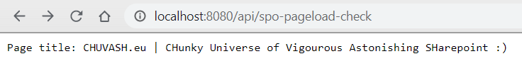

# Introduction

My first lab with a Docker based Azure Function

Commands and scripts:

- [provision docker](docker-provision.ps1)
- [provision azure](azure-provision.ps1)

# Used Resources

- Estruyf docker image: [azure-function-node-puppeteer](https://hub.docker.com/r/estruyf/azure-function-node-puppeteer)
- MSDocs [Create a function on Linux using a custom image](https://docs.microsoft.com/en-us/azure/azure-functions/functions-create-function-linux-custom-image?tabs=nodejs)
